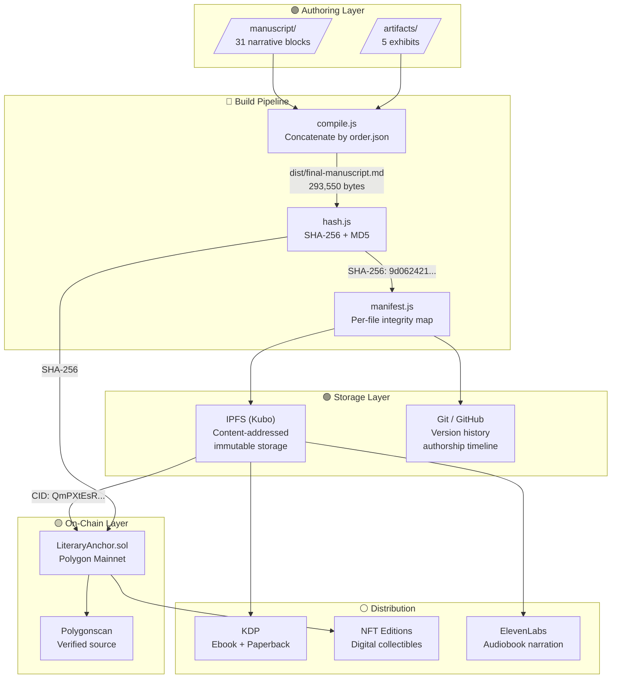
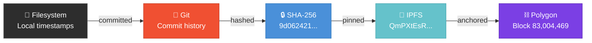
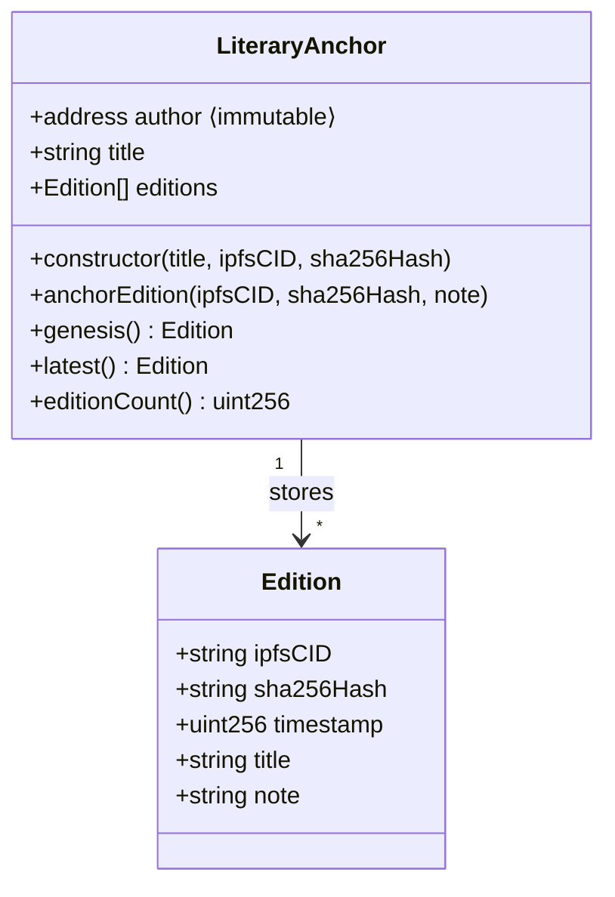
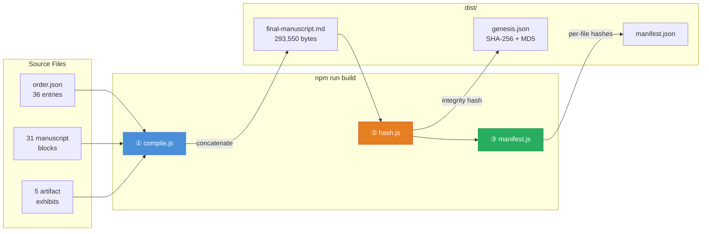
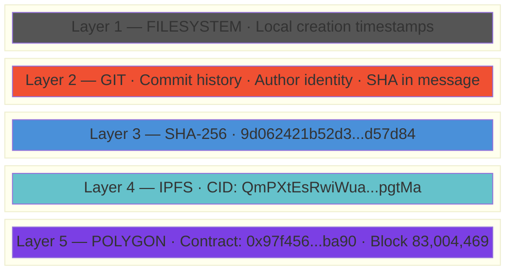
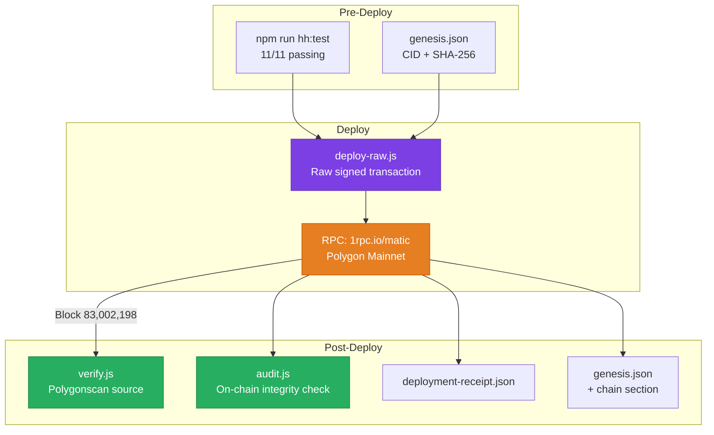
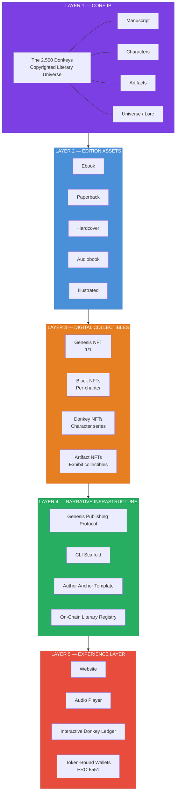
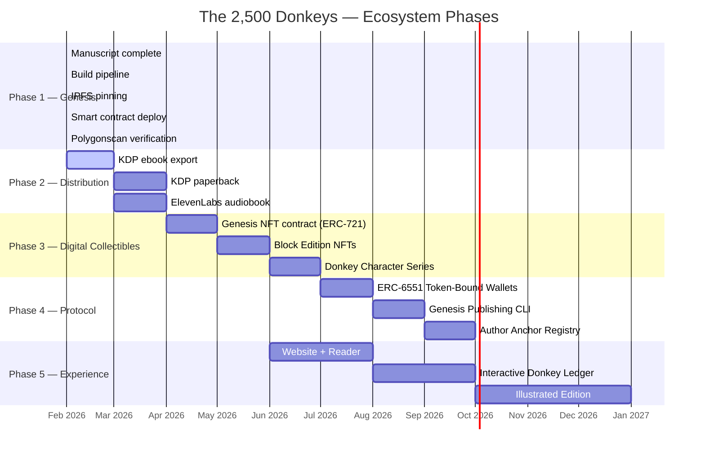
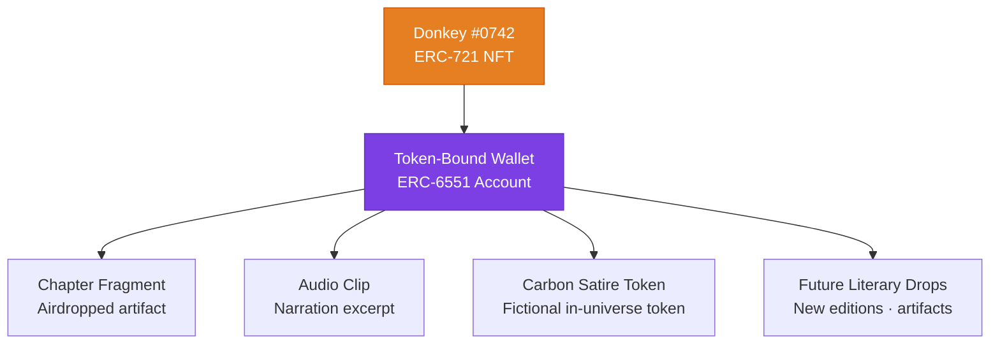
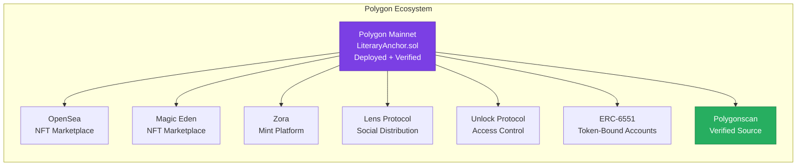

<p align="center">
  
  
  
  
  
</p>

<h1 align="center">The 2,500 Donkeys</h1>
<h3 align="center">A Sovereign Web3 Literary Protocol</h3>
<p align="center"><em>by Kidd James</em></p>

<p align="center">
  <a href="https://polygonscan.com/address/0x97f456300817eaE3B40E235857b856dfFE8bba90#code">
    
  </a>
  <a href="https://polygonscan.com/tx/0x9c036d1d8e946e0d9c8c520d4818e3d211c137478f7a704b733fbea500f28ec6">
    
  </a>
  <a href="https://xxxiii.io">
    
  </a>
</p>

---

## Table of Contents

| # | Section | Description |
|:-:|---------|-------------|
| **I** | [Overview](#i-overview) | What this is and why it exists |
| **II** | [Architecture](#ii-architecture) | System design and flow diagrams |
| **III** | [Project Structure](#iii-project-structure) | Repository layout and file map |
| **IV** | [The Novel](#iv-the-novel) | Narrative blocks and artifact exhibits |
| **V** | [Build Pipeline](#v-build-pipeline) | Deterministic compilation system |
| **VI** | [Provenance Stack](#vi-provenance-stack) | Five-layer integrity chain |
| **VII** | [Smart Contract](#vii-smart-contract--literaryanchorsol) | LiteraryAnchor.sol — on-chain anchor |
| **VIII** | [Polygon Deployment](#viii-polygon-deployment) | Mainnet deployment details and verification |
| **IX** | [Protocol Specification](#ix-protocol-specification) | State machine, invariants, deployment registry |
| **X** | [Asset Architecture](#x-asset-architecture) | Five-layer asset ecosystem map |
| **XI** | [Ecosystem Roadmap](#xi-ecosystem-roadmap) | NFTs, ERC-6551, Audio, Visual, Platform |
| **XII** | [Agentic Quality Gates](#xii-agentic-quality-gates) | Automated editorial and build enforcement |
| **XIII** | [Developer Quick Start](#xiii-developer-quick-start) | Setup, build, test, deploy commands |
| **XIV** | [Intellectual Property](#xiv-intellectual-property) | Ownership, rights, and legal clarity |
| **XV** | [License](#xv-license) | Dual license structure |

---

## I. Overview

A finance satire novel built as a proof-of-concept for sovereign Web3 publishing.

The story dissects how **narrative outpaces verification in opaque financial ecosystems** — through the lens of discounted gold deals, WhatsApp broker chains, ESG monetization theater, and 2,500 donkeys walking across a desert.

The infrastructure proves that authors can publish immutably, control rights, and anchor authorship on-chain — without publishers, without intermediaries, without permission.

> *"Belief travels faster than verification."*
> — First Law of the Parking Lot

### Three Layers (Cleanly Separated)

| Layer | Purpose | Status |
|:------|:--------|:------:|
| 🟣 **The Novel** | Literary satire. Commercially readable. Observational, not preachy. | ✅ Complete |
| 🔵 **The Satire** | Critique of narrative leverage in commodity brokerage, ESG hype, and commission culture. | ✅ Complete |
| 🟢 **The Protocol** | IPFS + on-chain anchor. Deterministic build. Proof-of-origin. Publishing template. | ✅ Deployed |

---

## II. Architecture

### System Flow



### Provenance Chain



### Contract Architecture



---

## III. Project Structure

```
2500-donkeys/
│
├── 🟣 NARRATIVE
│   ├── manuscript/                    Canonical prose — 31 blocks
│   │   ├── block-00-genesis.md        The origin. The parking lot epiphany.
│   │   ├── block-01-parking-lots.md   Where all gold deals begin.
│   │   ├── block-01a-raymonds-deal.md Raymond's first deal. [Layer A]
│   │   ├── block-01b-geralds-lot.md   Gerald's parking lot. [Layer A]
│   │   ├── block-01c-marcus-connection.md The connection. [Layer A]
│   │   ├── block-02-paper.md          The document ecosystem.
│   │   ├── block-02a-seven-families.md The families who control nothing. [Layer A]
│   │   ├── block-03-whatsapp.md       The broadcast layer.
│   │   ├── block-03a–e (5 blocks)     WhatsApp mutations: Lagos, Dubai, Zurich, NGO, Carbon. [Layer B]
│   │   ├── block-04-donkeys.md        2,500 donkeys. Tangier corridor.
│   │   ├── block-04a-storyteller-origin.md The Storyteller's vault. [Layer A]
│   │   ├── block-05-procession.md     The logistics of belief.
│   │   ├── block-05a-philippe-geneva.md Philippe's Geneva WeWork. [Layer A]
│   │   ├── block-05b–g (6 blocks)     The Procession: departure → arrival. [Layer C]
│   │   ├── block-06-humanitarian.md   ESG theater meets carbon opacity.
│   │   ├── block-06a-processing.md    Processing at the settlement. [Layer C]
│   │   ├── block-07-silence.md        When the music stops.
│   │   ├── block-07a–d (4 blocks)     Aftermath: home, dying groups, summit, resurrection. [Layer D]
│   │   └── epilogue.md               The deal that never closes.
│   │
│   └── artifacts/                     In-book exhibits — 5 files
│       ├── imfpa-redline-v3.md        Irrevocable fee agreement (redlined)
│       ├── commission-waterfall.md    Four-tier commission structure
│       ├── whatsapp-forward-17.md     The forward that started it all
│       ├── esg-deck-excerpt.md        Carbon credit pitch deck
│       └── carbon-registry-summary.md Registry compliance theater
│
├── 🔵 BUILD SYSTEM
│   ├── build/
│   │   ├── compile.js                 Concatenates blocks → final manuscript
│   │   ├── hash.js                    SHA-256 + MD5 integrity hashes
│   │   ├── manifest.js                Per-file hash manifest
│   │   └── order.json                 Canonical build order
│   └── dist/                          ⟨generated — not committed⟩
│       ├── final-manuscript.md        Compiled output (293,550 bytes)
│       └── manifest.json              File-level integrity map
│
├── 🟢 WEB3 INFRASTRUCTURE
│   └── web3/
│       ├── contracts/
│       │   └── LiteraryAnchor.sol     Solidity 0.8.19 — proof-of-origin
│       ├── scripts/
│       │   ├── deploy.js              Hardhat deployment script
│       │   ├── deploy-raw.js          Raw transaction deployment (mainnet)
│       │   ├── deploy-direct.js       Standalone ethers.js deployment
│       │   ├── verify.js              Polygonscan source verification
│       │   ├── audit.js               On-chain integrity audit
│       │   └── anchor-edition2.js     Edition 2 anchor script
│       ├── test/
│       │   └── LiteraryAnchor.test.js 11 tests — full coverage
│       ├── metadata/
│       │   ├── genesis.json           Build + IPFS + Chain provenance
│       │   └── deployment-receipt.json Deployment transaction data
│       ├── artifacts/                 ⟨generated — Hardhat compilation⟩
│       ├── cache/                     ⟨generated — Hardhat cache⟩
│       ├── ipfs/                      IPFS upload utilities
│       └── DEPLOY.md                  Step-by-step deployment guide
│
├── 📋 PROJECT FILES
│   ├── AGENT.md                       Agentic quality gate definitions
│   ├── LITERARY_PROTOCOL.md           Protocol spec — state machine + roles
│   ├── INVARIANTS.md                  System invariants and guarantees
│   ├── DEPLOYMENTS.md                 Canonical deployment registry
│   ├── glossary.md                    In-universe terminology (94 terms)
│   ├── style-guide.md                 Voice, tone, and prose rules
│   ├── hardhat.config.js              Polygon + Amoy network config
│   ├── package.json                   Scripts and dependencies
│   ├── LICENSE                        MIT (tooling) + © (literary content)
│   └── README.md                      ← You are here
│
├── 🌐 SITE
│   └── site/                          Cloudflare Pages — xxxiii.io
│       ├── index.html                 Literary landing page
│       └── style.css                  Dark theme, serif typography
│
└── 🔒 PRIVATE (gitignored)
    ├── .env                           Keys, RPC, wallet config
    └── node_modules/                  Dependencies
```

---

## IV. The Novel

### Narrative Blocks

| # | Block | Title | Layer | Focus |
|:-:|-------|-------|:-----:|-------|
| 0 | `block-00-genesis` | Genesis | — | The parking lot. The phone call. The first deal. |
| 1 | `block-01-parking-lots` | Parking Lots | — | Where all gold deals begin and most die. |
| 1a | `block-01a-raymonds-deal` | Raymond's First Deal | A | The first commission. The first lie. |
| 1b | `block-01b-geralds-lot` | Gerald's Lot | A | The parking lot where deals come to breathe. |
| 1c | `block-01c-marcus-connection` | The Connection | A | The man who connects everyone to no one. |
| 2 | `block-02-paper` | Paper | — | IMFPA, BCL, CIS — the document ecosystem. |
| 2a | `block-02a-seven-families` | The Seven Families | A | The families who control everything and nothing. |
| 3 | `block-03-whatsapp` | WhatsApp | — | The broadcast layer. Forward #17. |
| 3a | `block-03a-mutation-lagos` | Lagos Variant | B | The deal mutates through Lagos WhatsApp. |
| 3b | `block-03b-mutation-dubai` | Dubai Variant | B | Gold brokers in marina apartments. |
| 3c | `block-03c-mutation-zurich` | Zurich Variant | B | Compliance theater in Swiss German. |
| 3d | `block-03d-mutation-ngo` | The Aid Wash | B | Humanitarian corridors that wash nothing clean. |
| 3e | `block-03e-mutation-carbon` | The Conference | B | Carbon credits at a conference no one remembers. |
| 4 | `block-04-donkeys` | Donkeys | — | 2,500 donkeys. Tangier corridor. Logistics of belief. |
| 4a | `block-04a-storyteller-origin` | The Vault | A | The Storyteller's origin. The parking lot before the parking lot. |
| 5 | `block-05-procession` | Procession | — | The caravan that may or may not exist. |
| 5a | `block-05a-philippe-geneva` | The WeWork | A | Philippe's Geneva coworking empire. |
| 5b | `block-05b-departure` | Departure | C | The donkeys begin to walk. |
| 5c | `block-05c-attrition` | Attrition | C | The ones that don't make it. |
| 5d | `block-05d-bandit-corridor` | Bandit Corridor | C | Armed men. Silent negotiation. |
| 5e | `block-05e-green-zone` | Green Zone | C | The safe passage that isn't safe. |
| 5f | `block-05f-collapse` | Collapse | C | When the formation breaks. |
| 5g | `block-05g-arrival` | Arrival | C | What arrives is not what departed. |
| 6 | `block-06-humanitarian` | Humanitarian | — | ESG theater, carbon credits, moral ballast. |
| 6a | `block-06a-processing` | Processing | C | The settlement processes what remains. |
| 7 | `block-07-silence` | Silence | — | When the music stops. The call that doesn't come. |
| 7a | `block-07a-raymond-home` | The Woodlands | D | Raymond goes home. The subdivision is unchanged. |
| 7b | `block-07b-groups-dying` | The Groups Dying | D | WhatsApp groups go silent, one by one. |
| 7c | `block-07c-storyteller-summit` | The Summit | D | The Storyteller speaks at a London conference. |
| 7d | `block-07d-resurrection` | Resurrection | D | A yak-backed lithium corridor is born. |
| E | `epilogue` | Epilogue | — | The deal that never closes. |

### Artifact Exhibits

| # | Exhibit | Type | Satire Target |
|:-:|---------|------|---------------|
| A | `imfpa-redline-v3.md` | Legal document (redlined) | Irrevocable agreements that are revocable by silence |
| B | `commission-waterfall.md` | Financial structure | Commissions finalized before product exists |
| C | `whatsapp-forward-17.md` | Communication artifact | The broadcast layer of belief propagation |
| D | `esg-deck-excerpt.md` | Pitch deck excerpt | ESG vocabulary as moral ballast |
| E | `carbon-registry-summary.md` | Compliance document | Registry theater that registers nothing |

---

## V. Build Pipeline

### Deterministic Compilation



### Build Commands

```powershell
# Full deterministic build (all three steps)
npm run build

# Individual steps
npm run compile       # Step 1: Concatenate → dist/final-manuscript.md
npm run hash          # Step 2: SHA-256 → web3/metadata/genesis.json
npm run manifest      # Step 3: Per-file → dist/manifest.json
```

### Genesis Output

| Field | Value |
|-------|-------|
| **SHA-256 (Edition 2)** | `9d062421b52d35aa23b73bfc8f66574db78bad9726e45c43a12d0109cdd57d84` |
| **SHA-256 (Genesis)** | `cdef74d157437eeeb20d474fa7fcb590c83f87668aa109c036c76ac21e578364` |
| **Size (Edition 2)** | 293,550 bytes |
| **Size (Genesis)** | 49,224 bytes |
| **Source** | `dist/final-manuscript.md` |

> Identical input always produces identical output. The build is deterministic.

---

## VI. Provenance Stack

Five independent layers, each cryptographically reinforcing the others:



| Layer | Mechanism | What It Proves | Verification |
|:-----:|-----------|----------------|:------------:|
| 1 | Filesystem | Creation timeline | Local |
| 2 | Git / GitHub | Authorship + version history | `git log` |
| 3 | SHA-256 | Content integrity — any byte change invalidates | `sha256sum` |
| 4 | IPFS | Immutable content-addressed storage | Gateway fetch |
| 5 | Polygon | Timestamped on-chain proof-of-origin | [Polygonscan](https://polygonscan.com/address/0x97f456300817eaE3B40E235857b856dfFE8bba90#code) |

---

## VII. Smart Contract — LiteraryAnchor.sol

<table>
<tr><td><strong>Contract</strong></td><td><code>0x97f456300817eaE3B40E235857b856dfFE8bba90</code></td></tr>
<tr><td><strong>Network</strong></td><td>Polygon Mainnet (Chain ID 137)</td></tr>
<tr><td><strong>Solidity</strong></td><td>0.8.19 · Optimizer: 200 runs</td></tr>
<tr><td><strong>Source</strong></td><td><a href="https://polygonscan.com/address/0x97f456300817eaE3B40E235857b856dfFE8bba90#code">Verified on Polygonscan ✓</a></td></tr>
<tr><td><strong>Author</strong></td><td><code>0xC91668184736BF75C4ecE37473D694efb2A43978</code> (immutable)</td></tr>
</table>

### Contract Interface

```solidity
// SPDX-License-Identifier: MIT
pragma solidity ^0.8.19;

contract LiteraryAnchor {
    struct Edition {
        string ipfsCID;
        string sha256Hash;
        uint256 timestamp;
        string title;
        string note;
    }

    address public immutable author;
    string  public title;
    Edition[] public editions;

    // Deploy with genesis edition
    constructor(string memory _title, string memory _ipfsCID, string memory _sha256Hash);

    // Anchor subsequent editions (author-only)
    function anchorEdition(string calldata _ipfsCID, string calldata _sha256Hash, string calldata _note) external;

    // Read functions
    function genesis() external view returns (Edition memory);
    function latest()  external view returns (Edition memory);
    function editionCount() external view returns (uint256);
}
```

### On-Chain Audit Results

```
══════════════════════════════════════════════════
  ON-CHAIN AUDIT — LiteraryAnchor
══════════════════════════════════════════════════

  Title:         The 2,500 Donkeys         ✓
  Author:        0xC916...3978             ✓
  Edition Count: 4
  Genesis CID:   QmVQ79NM3...g8vK         ✓ MATCH
  Latest CID:    QmPXtEsR...pgtMa         ✓ MATCH
  SHA-256:       9d062421...d84           ✓ MATCH

  All provenance layers aligned.
══════════════════════════════════════════════════
```

### Test Suite

```
  LiteraryAnchor
    Deployment
      ✓ Should set the author to deployer
      ✓ Should set the title
      ✓ Should create genesis edition with correct CID
      ✓ Should create genesis edition with correct SHA-256
      ✓ Should emit EditionAnchored event on deploy
    Edition management
      ✓ Should allow author to anchor a new edition
      ✓ Should increment edition count
      ✓ Should reject non-author edition anchoring
    View functions
      ✓ Should return genesis edition
      ✓ Should return latest edition
      ✓ Should return correct edition count

  11 passing
```

---

## VIII. Polygon Deployment

### Genesis Transaction

| Field | Value |
|-------|-------|
| **Contract** | [`0x97f456300817eaE3B40E235857b856dfFE8bba90`](https://polygonscan.com/address/0x97f456300817eaE3B40E235857b856dfFE8bba90) |
| **Tx Hash** | [`0x9c036d1d...28ec6`](https://polygonscan.com/tx/0x9c036d1d8e946e0d9c8c520d4818e3d211c137478f7a704b733fbea500f28ec6) |
| **Block** | [83,002,198](https://polygonscan.com/block/83002198) |
| **Gas Used** | 1,116,006 |
| **Cost** | 0.887 POL |
| **Deployer** | [`0xC91668184736BF75C4ecE37473D694efb2A43978`](https://polygonscan.com/address/0xC91668184736BF75C4ecE37473D694efb2A43978) |
| **Verified** | [✓ Source code verified](https://polygonscan.com/address/0x97f456300817eaE3B40E235857b856dfFE8bba90#code) |

### Constructor Arguments

```json
[
  "The 2,500 Donkeys",
  "QmVQ79NM3qxAsBpftTG4YhD4KV9sUEmM3WwFrc5vs5g8vK",
  "cdef74d157437eeeb20d474fa7fcb590c83f87668aa109c036c76ac21e578364"
]
```

### Deployment Pipeline



---

## IX. Protocol Specification

The protocol is formalized across three documents that elevate this from a project to a system:

| Document | Purpose |
|----------|--------|
| [`LITERARY_PROTOCOL.md`](LITERARY_PROTOCOL.md) | State machine definition, asset types, roles, failure modes, governance |
| [`INVARIANTS.md`](INVARIANTS.md) | Content, contract, provenance, and supply invariants |
| [`DEPLOYMENTS.md`](DEPLOYMENTS.md) | Canonical deployment registry — every tx, CID, hash, block |

### State Machine

```
DRAFT → COMPILED → HASHED → PINNED → ANCHORED → PUBLISHED
```

Each edition progresses through this linear sequence. No state can be skipped or reversed. The full specification is in [`LITERARY_PROTOCOL.md`](LITERARY_PROTOCOL.md).

### Key Invariants

- **INV-C1:** SHA-256 on-chain must match the SHA-256 of IPFS-pinned content
- **INV-K1:** Author address is immutable — set once, stored in bytecode
- **INV-K2:** Genesis edition cannot be overwritten or deleted
- **INV-K3:** Editions are append-only
- **INV-P1:** All five provenance layers must be consistent for any published edition

Full invariant definitions in [`INVARIANTS.md`](INVARIANTS.md).

---

## X. Asset Architecture

### Five-Layer Asset Ecosystem



### Asset Classification Matrix

| Class | Asset | Type | Status |
|:-----:|-------|------|:------:|
| 🟣 | Literary manuscript + universe | Primary IP | ✅ Created |
| 🟣 | Publishing protocol framework | Infrastructure IP | ✅ Built |
| 🔵 | Ebook (KDP) | Edition | 🔲 Pending |
| 🔵 | Paperback (KDP) | Edition | 🔲 Pending |
| 🔵 | Audiobook (ElevenLabs) | Edition + Audio IP | 🔲 Pending |
| 🟠 | Genesis NFT (1/1) | Digital Collectible | 🔲 Planned |
| 🟠 | Block Edition NFTs | Digital Collectible | 🔲 Planned |
| 🟠 | Donkey Character NFTs (2,500) | Digital Collectible | 🔲 Planned |
| 🟠 | Artifact Exhibit NFTs | Digital Collectible | 🔲 Planned |
| 🟢 | ERC-6551 Token-Bound Wallets | Protocol Extension | 🔲 Planned |
| 🟢 | Genesis Publishing Protocol CLI | Platform / SaaS | 🔲 Planned |
| 🔴 | Illustrated Edition | Derivative IP | 🔲 Future |
| 🔴 | Film / Adaptation Rights | Derivative IP | 🔲 Future |

---

## XI. Ecosystem Roadmap

### Phase Map



### A. NFT Editions — Digital Collectibles

> **Collectibles, not securities.** These represent ownership of digital art and literary artifacts. They do not confer copyright, profit sharing, or investment returns.

| Edition | Supply | Description |
|---------|:------:|-------------|
| **Genesis** | 1/1 | The original manuscript anchor — singular provenance artifact |
| **Founder** | 25 | Early supporter editions — unique cover art variants |
| **Block** | 9 × 100 | Per-chapter collectibles — one for each narrative block |
| **Donkey** | 2,500 | Character-series collectibles — generative donkey identities |
| **Artifact** | 5 × 50 | Exhibit collectibles — IMFPA, waterfall, WhatsApp, ESG deck, registry |

### B. ERC-6551 Token-Bound Donkeys

Each Donkey NFT becomes a character-account with its own wallet:



**What this enables:**
- Each Donkey NFT **holds** literary assets in its own wallet
- Airdrops go to the Donkey, not the owner — creating narrative accumulation
- No staking. No yield. No profit promise. Art and literature only.

### C. Revenue Streams (Non-Securities)

| Stream | Source | Type |
|--------|--------|------|
| Ebook sales | KDP / Direct | Publishing revenue |
| Paperback sales | KDP | Publishing revenue |
| Audiobook sales | Audible / Direct | Streaming revenue |
| NFT primary sales | Polygon marketplace | Collectible sales |
| NFT royalties | Secondary market | Creator royalty (ERC-2981) |
| Illustrated edition | Direct / Gallery | Art sales |
| Film/adaptation rights | Licensing | IP licensing |
| Publishing Protocol | SaaS / Open-source | Platform revenue |

### D. Polygon Ecosystem Integration



---

## XII. Agentic Quality Gates

Three internal roles enforce quality across the protocol:

| # | Role | Responsibility | Trigger |
|:-:|------|---------------|---------|
| 1 | **The Editor** | Tone enforcement. Removes preachiness. Maintains deadpan anthropologist voice. | After any prose edit |
| 2 | **The Continuity Auditor** | Internal consistency. Commission math, tonnage, character names, artifact cross-refs. | After any content change |
| 3 | **The Format Guardian** | Deterministic build protection. Style-guide compliance. Manifest integrity. | Before any commit |

### The Editor — Red Flags

> 🚫 "shocking truth" · "they don't want you to know" · "wake up" · exclamation marks in prose

### The Continuity Auditor — Validation Checks

> ✓ Commission waterfall sums to 8.4% across 4 tiers · ✓ Tonnage: 500MT base · ✓ Characters: Raymond, Marcus, Gerald, Philippe · ✓ SHA-256 in genesis.json matches compiled output

### The Format Guardian — Enforcement Rules

> ✓ Headings follow style-guide.md · ✓ No trailing whitespace · ✓ order.json matches filesystem · ✓ `npm run build` is idempotent

See [AGENT.md](AGENT.md) for full role definitions.

---

## XIII. Developer Quick Start

### Prerequisites

- Node.js 18+
- Git
- A `.env` file (see template below)

### Environment Template

```env
# .env.example
POLYGON_RPC=https://polygon-bor-rpc.publicnode.com
AUTHOR_WALLET=0xYourWalletAddress
PRIVATE_KEY=your_private_key_without_0x_prefix
POLYGONSCAN_API_KEY=your_polygonscan_api_key

# Optional
AMOY_RPC=https://rpc-amoy.polygon.technology
IPFS_API=http://127.0.0.1:5001
IPFS_GATEWAY=http://127.0.0.1:8080
ELEVENLABS_API_KEY=your_elevenlabs_key
```

### Command Reference

| Command | Description |
|---------|-------------|
| `npm run build` | Full deterministic build (compile → hash → manifest) |
| `npm run compile` | Concatenate manuscript + artifacts → `dist/final-manuscript.md` |
| `npm run hash` | Generate SHA-256 + MD5 → `web3/metadata/genesis.json` |
| `npm run manifest` | Per-file integrity hashes → `dist/manifest.json` |
| `npm run hh:compile` | Compile Solidity contracts |
| `npm run hh:test` | Run test suite (11 tests) |
| `npm run deploy:amoy` | Deploy to Polygon Amoy testnet (dry run) |
| `npm run deploy:polygon` | Deploy to Polygon mainnet |
| `npm run verify` | Verify source on Polygonscan |
| `npm run audit:chain` | Audit on-chain state vs local genesis.json |

### Full Deploy Sequence

```powershell
# 1. Build the manuscript
npm run build

# 2. Compile + test contracts
npm run hh:compile
npm run hh:test

# 3. Deploy (testnet first, then mainnet)
npm run deploy:amoy          # dry run
npm run deploy:polygon        # production

# 4. Verify + audit
npm run verify
npm run audit:chain

# 5. Commit the anchor
git add .
git commit -m "Genesis locked"
git push origin master
```

See [web3/DEPLOY.md](web3/DEPLOY.md) for the complete deployment guide.

---

## XIV. Intellectual Property

### Ownership Statement

> **The 2,500 Donkeys** and all associated narrative content, characters, artifacts, universe lore, and publishing frameworks are intellectual property of the author, **Kidd James**. Blockchain anchoring provides cryptographic proof of authorship and timestamping. Digital collectibles (NFTs) represent ownership of a digital collectible linked to a narrative artifact — they do not confer copyright ownership, revenue rights, or equity unless explicitly stated in a separate written agreement.

### Provenance Evidence Chain

| Evidence | Purpose | Record |
|----------|---------|--------|
| Local filesystem | First creation timestamps | OS metadata |
| Git commit history | Continuous authorship timeline | [GitHub](https://github.com/FTHTrading/2500-donkeys) |
| SHA-256 hash | Content integrity fingerprint | `genesis.json` |
| IPFS CID | Immutable content-addressed storage | `QmVQ79NM3...g8vK` |
| Polygon smart contract | Timestamped on-chain proof-of-origin | [`0x97f456...ba90`](https://polygonscan.com/address/0x97f456300817eaE3B40E235857b856dfFE8bba90) |
| Polygonscan verification | Public source code transparency | [Verified ✓](https://polygonscan.com/address/0x97f456300817eaE3B40E235857b856dfFE8bba90#code) |

### What This Is — And What It Is Not

| | |
|:-:|---|
| ❌ | Not a token sale, ICO, or speculation scheme |
| ❌ | Not a revenue-sharing instrument or investment vehicle |
| ❌ | Not a conspiracy manifesto or accusation of any real person |
| ✅ | Satire. Observational. Pattern recognition through narrative. |
| ✅ | NFTs are collectibles — art and literature, not financial instruments |
| ✅ | Protocol is open infrastructure — any author can use the framework |

---

## XV. License

### Dual License Structure

| Scope | License | Details |
|-------|---------|---------|
| **Build tooling, scripts, smart contracts** | MIT | Free to use, modify, distribute |
| **Literary content** (manuscript, artifacts, characters, universe) | © Kidd James | All rights reserved |

The publishing protocol infrastructure is open-source so other authors can build on it. The literary work itself is copyrighted. These are deliberately separated — the protocol serves the ecosystem, the content serves the author.

---

<p align="center">
  
</p>

<p align="center">
  <em>"The deal expanded in inverse proportion to its certainty."</em>
</p>

<p align="center">
  <sub>Built with conviction. Anchored with cryptography. Verified on <a href="https://polygonscan.com/address/0x97f456300817eaE3B40E235857b856dfFE8bba90#code">Polygon</a>.</sub>
</p>
