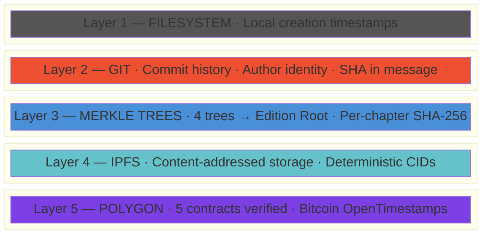
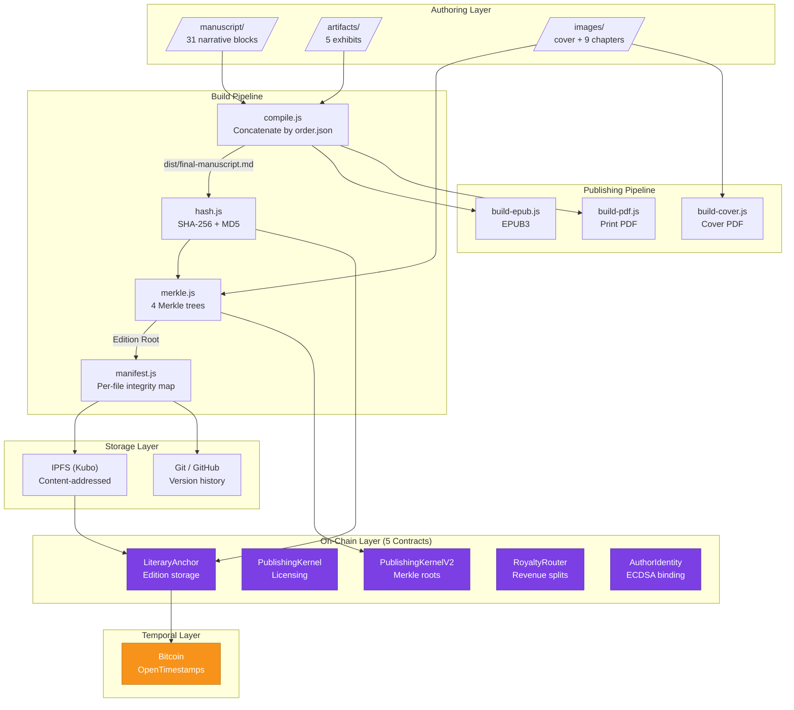
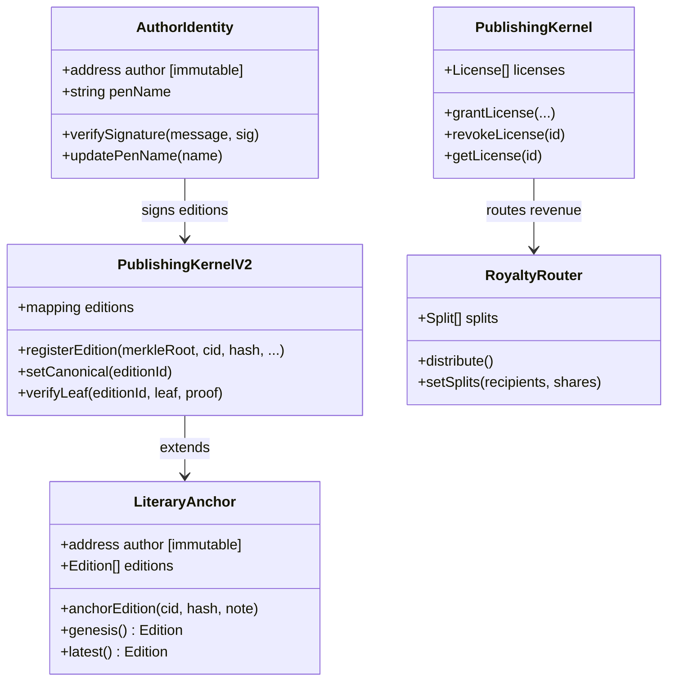
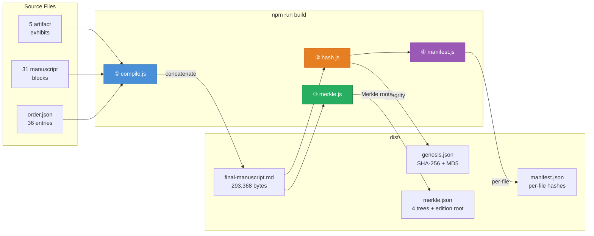

<p align="center">
  
  
  
  
  
  
  
  
</p>

<h1 align="center">The 2,500 Donkeys</h1>
<h3 align="center">Deterministic Literary Publishing Protocol</h3>
<p align="center"><em>by Kidd James (Kevan Burns)</em></p>

<p align="center">
  <a href="https://doi.org/10.5281/zenodo.18646886"></a>
  <a href="https://orcid.org/0009-0008-8425-939X"></a>
  <a href="https://xxxiii.io"></a>
  <a href="https://polygonscan.com/address/0xca9F6604A9b498DB31d113836E2957c0a9aAE037#code"></a>
  <a href="https://github.com/FTHTrading/2500-donkeys/actions/workflows/verify.yml"></a>
</p>

---

> **📄 [LPS-1 v1.0 Public Release Announcement](docs/ANNOUNCEMENT_LPS1_v1.0.md)** — Executive summary, verification path, compliance claim, and roadmap in one document.

<details>
<summary><strong>Quick Links</strong></summary>

| Resource | Link |
|----------|------|
| **Announcement** | [ANNOUNCEMENT_LPS1_v1.0.md](docs/ANNOUNCEMENT_LPS1_v1.0.md) |
| **LPS-1 Specification** | [LPS-1.md](docs/spec/LPS-1.md) |
| **LPS Stack Architecture** | [LPS-STACK.md](docs/spec/LPS-STACK.md) |
| **Compliance Matrix (L0–L5)** | [COMPLIANCE.md](docs/spec/COMPLIANCE.md) |
| **Governance** | [GOVERNANCE.md](docs/spec/GOVERNANCE.md) |
| **Roadmap** | [ROADMAP.md](docs/ROADMAP.md) |
| **Funding Brief** | [FUNDING_BRIEF.md](docs/FUNDING_BRIEF.md) |
| **Reference Implementation** | [FTHTrading/LPS-1-Reference-Implementation](https://github.com/FTHTrading/LPS-1-Reference-Implementation) |
| **Protocol Site** | [xxxiii.io](https://xxxiii.io) |
| **DOI** | [10.5281/zenodo.18646886](https://doi.org/10.5281/zenodo.18646886) |

</details>

### Verify in 90 Seconds

```bash
git clone https://github.com/FTHTrading/2500-donkeys.git
cd 2500-donkeys
npm install
npm run lps:verify
```

---

## Table of Contents

| # | Section | Description |
|:-:|---------|-------------|
| **I** | [Overview](#i-overview) | What this is and why it exists |
| **II** | [System Architecture](#ii-system-architecture) | Five-layer provenance model |
| **III** | [Smart Contract Architecture](#iii-smart-contract-architecture) | Five verified contracts on Polygon |
| **IV** | [Merkle Tree System](#iv-merkle-tree-system) | Six-tree content integrity (4 novel + 2 stories) |
| **V** | [Project Structure](#v-project-structure) | Repository layout and file map |
| **VI** | [The Novel](#vi-the-novel) | 31 narrative blocks and 5 artifact exhibits |
| **VII** | [The Stories Collection](#vii-the-stories-collection) | Protocol validation node — 13 satirical stories |
| **VIII** | [Build Pipeline](#viii-build-pipeline) | Deterministic compilation system |
| **IX** | [Publishing Pipeline](#ix-publishing-pipeline) | EPUB, PDF, and cover generation |
| **X** | [Deployment Registry](#x-deployment-registry) | All five contract deployments |
| **XI** | [Test Suite](#xi-test-suite) | 146 tests across 5 contracts |
| **XII** | [Academic Infrastructure](#xii-academic-infrastructure) | DOI, ORCID, research paper, citations |
| **XIII** | [Protocol Specification (LPS-1)](#xiii-protocol-specification-lps-1) | Literary Protocol Standard v1 |
| **XIV** | [Developer Quick Start](#xiv-developer-quick-start) | Setup, build, test, deploy |
| **XV** | [Audio Provenance (IAPL-1)](#xv-audio-provenance-iapl-1) | Immutable Audio Provenance Layer |
| **XVI** | [Intellectual Property](#xvi-intellectual-property) | Ownership, rights, legal clarity |
| **XVII** | [License](#xvii-license) | Dual license structure |

---

## I. Overview

A 75,000-word novel built as the reference implementation for a deterministic publishing protocol. The infrastructure proves that a single author, with no institutional backing, can construct a multi-layer provenance chain for a literary manuscript — cryptographically verifiable by anyone, at a total cost under $2.50.

The story dissects how **narrative outpaces verification in opaque financial ecosystems** — through the lens of discounted gold deals, WhatsApp broker chains, ESG monetization theater, and 2,500 donkeys walking across a desert.

> *"Belief travels faster than verification."*
> — First Law of the Parking Lot

### Three Layers (Cleanly Separated)

| Layer | Purpose | Status |
|:------|:--------|:------:|
| **The Novel** | Literary satire. 31 chapters + 5 artifacts. Observational, not preachy. | ✅ Complete |
| **The Stories** | Short fiction collection. 13 satirical stories + audio narration. Protocol validation node. | ✅ Anchored |
| **The Protocol** | Five-contract on-chain architecture. Merkle trees. IPFS. Bitcoin timestamp. | ✅ Deployed |
| **The Paper** | Peer-verifiable research paper. DOI-archived. 14 system invariants. | ✅ Published |

### At a Glance

| Metric | Value |
|--------|-------|
| **Works** | 2 — *The 2,500 Donkeys* (novel) + *Private Placement Puppetry* (stories) |
| **Words** | ~75,000 (novel) + ~30,000 (stories) |
| **Chapters** | 31 blocks + 5 artifacts (novel) · 13 stories + front/back matter (stories) |
| **Smart Contracts** | 5 (all verified on Polygonscan) |
| **Tests** | 146 passing |
| **Merkle Trees** | 4 (novel: manuscript, artifact, image, prompt) + 2 (stories: manuscript, audio) |
| **IPFS CIDs** | 3 editions pinned |
| **Deployment Cost** | ~$2.50 total |
| **DOI** | [10.5281/zenodo.18646886](https://doi.org/10.5281/zenodo.18646886) |
| **ORCID** | [0009-0008-8425-939X](https://orcid.org/0009-0008-8425-939X) |

---

## II. System Architecture

### Five-Layer Provenance Model



| Layer | Mechanism | What It Proves | Verification |
|:-----:|-----------|----------------|:------------:|
| 1 | Filesystem | Creation timeline | Local |
| 2 | Git / GitHub | Authorship + version history | `git log` |
| 3 | Merkle Trees | Per-chapter integrity + edition root | `node build/merkle.js` |
| 4 | IPFS | Immutable content-addressed storage | Any IPFS gateway |
| 5 | Polygon + Bitcoin | Timestamped on-chain proof-of-origin | [Polygonscan](https://polygonscan.com/address/0xca9F6604A9b498DB31d113836E2957c0a9aAE037#code) |

### System Flow



---

## III. Smart Contract Architecture

Five contracts deployed and source-verified on Polygon Mainnet. Total deployment cost: ~$1.80.



### Deployment Registry

| # | Contract | Address | Polygonscan |
|:-:|----------|---------|:-----------:|
| 1 | **LiteraryAnchor** | `0x97f456300817eaE3B40E235857b856dfFE8bba90` | [Verified ✓](https://polygonscan.com/address/0x97f456300817eaE3B40E235857b856dfFE8bba90#code) |
| 2 | **PublishingKernel** | `0x511c653fC0F450ba41C42A89A3125CcBf2eFE8ae` | [Verified ✓](https://polygonscan.com/address/0x511c653fC0F450ba41C42A89A3125CcBf2eFE8ae#code) |
| 3 | **PublishingKernelV2** | `0xca9F6604A9b498DB31d113836E2957c0a9aAE037` | [Verified ✓](https://polygonscan.com/address/0xca9F6604A9b498DB31d113836E2957c0a9aAE037#code) |
| 4 | **RoyaltyRouter** | `0x44169829489d70aaecbf845870652871C65fC461` | [Verified ✓](https://polygonscan.com/address/0x44169829489d70aaecbf845870652871C65fC461#code) |
| 5 | **AuthorIdentity** | `0xB9ffa688A8Bb332221030BbBE46bE5bF03323170` | [Verified ✓](https://polygonscan.com/address/0xB9ffa688A8Bb332221030BbBE46bE5bF03323170#code) |

| Field | Value |
|-------|-------|
| **Network** | Polygon Mainnet (Chain ID: 137) |
| **Solidity** | 0.8.19 · Optimizer: 200 runs · viaIR: true |
| **Framework** | Hardhat 2.28.6 · Ethers 6.16.0 · OpenZeppelin 4.9.6 |
| **Author Wallet** | [`0xC91668184736BF75C4ecE37473D694efb2A43978`](https://polygonscan.com/address/0xC91668184736BF75C4ecE37473D694efb2A43978) |

---

## IV. Merkle Tree System

Six independent Merkle trees hash every content type across both works. Their roots are combined into **Edition Roots** — the cryptographic fingerprints of each literary work.

### Novel — 4 Trees → Edition Root

```
┌─────────────────────────────────────────────────────────┐
│                    EDITION ROOT                          │
│         H(manuscriptRoot ‖ artifactRoot ‖               │
│           imageRoot ‖ promptRoot)                        │
├──────────────┬──────────────┬────────────┬──────────────┤
│ manuscript   │ artifact     │ image      │ prompt       │
│ Root         │ Root         │ Root       │ Root         │
├──────────────┼──────────────┼────────────┼──────────────┤
│ block-00  ██ │ carbon    ██ │ cover  ██  │ style    ██  │
│ block-01  ██ │ waterfall ██ │ ch-00  ██  │ cover    ██  │
│ block-01a ██ │ esg       ██ │ ch-01  ██  │ genesis  ██  │
│ ...       ██ │ imfpa     ██ │ ...    ██  │ ...      ██  │
│ epilogue  ██ │ whatsapp  ██ │ ch-ep  ██  │ silence  ██  │
└──────────────┴──────────────┴────────────┴──────────────┘
```

| Tree | Leaves | What It Hashes |
|------|:------:|----------------|
| Manuscript | 31 | Every narrative block (SHA-256) |
| Artifact | 5 | Every in-book exhibit |
| Image | 10 | Cover + 9 chapter illustrations |
| Prompt | 10 | AI generation prompts for all images |

### Stories — 2 Trees → Combined Hash

```
┌───────────────────────────────────────────────┐
│               COMBINED HASH                    │
│     H(manuscriptRoot ‖ audioRoot)              │
├──────────────────────┬────────────────────────┤
│ manuscript Root      │ audio Root             │
├──────────────────────┼────────────────────────┤
│ 00-front-matter  ██  │ 01-the-deal.mp3    ██  │
│ 01-the-deal      ██  │ 02-the-due...      ██  │
│ ...              ██  │ ...                ██  │
│ 16-back-matter   ██  │ 13-the-final...    ██  │
└──────────────────────┴────────────────────────┘
```

| Tree | Leaves | What It Hashes |
|------|:------:|----------------|
| Manuscript | 16 | 13 stories + front/back matter (SHA-256) |
| Audio | 13 | Kokoro TTS narrations (SHA-256) |

### Verification

```bash
node build/merkle.js          # Rebuild novel trees (4) + edition root
node stories/stories-merkle.js # Rebuild stories trees (2) + combined hash
```

---

## V. Project Structure

```
2500-donkeys/
│
├── 📖 MANUSCRIPT
│   ├── manuscript/                    31 canonical narrative blocks
│   │   ├── block-00-genesis.md        The parking lot. The first deal.
│   │   ├── block-01 → block-07d      Core chapters + Layers A–D
│   │   └── epilogue.md               The deal that never closes.
│   └── artifacts/                     5 in-book exhibits
│       ├── imfpa-redline-v3.md        Irrevocable fee agreement (redlined)
│       ├── commission-waterfall.md    Four-tier commission structure
│       ├── whatsapp-forward-17.md     The forward that started it all
│       ├── esg-deck-excerpt.md        Carbon credit pitch deck
│       └── carbon-registry-summary.md Registry compliance theater
│
├── 🔧 BUILD SYSTEM
│   ├── build/
│   │   ├── compile.js                 Concatenate blocks → final manuscript
│   │   ├── hash.js                    SHA-256 + MD5 integrity hashes
│   │   ├── merkle.js                  4 Merkle trees → edition root
│   │   ├── manifest.js                Per-file hash manifest
│   │   ├── order.json                 Canonical build order (36 entries)
│   │   └── protocol.js               LPS-1 protocol enforcement
│   └── dist/                          Generated outputs
│       ├── final-manuscript.md        Compiled output (293,368 bytes)
│       ├── merkle.json                Merkle trees + edition root
│       ├── manifest.json              File-level integrity map
│       ├── edition.json               Edition metadata
│       ├── edition.ots               Bitcoin OpenTimestamps proof
│       ├── the-2500-donkeys.epub      EPUB3 ebook
│       ├── the-2500-donkeys-print.pdf Print-ready PDF
│       ├── cover.pdf                  Cover art
│       └── deterministic-literary-publishing.pdf  Research paper
│
├── ⛓️ SMART CONTRACTS (5 deployed + verified)
│   └── web3/
│       ├── contracts/
│       │   ├── LiteraryAnchor.sol     Proof-of-origin anchor
│       │   ├── PublishingKernel.sol    Licensing engine
│       │   ├── PublishingKernelV2.sol  Merkle-verified editions
│       │   ├── RoyaltyRouter.sol      Revenue distribution
│       │   └── AuthorIdentity.sol     ECDSA identity binding
│       ├── test/                      146 tests across 5 suites
│       │   ├── LiteraryAnchor.test.js
│       │   ├── PublishingKernel.test.js
│       │   ├── PublishingKernelV2.test.js
│       │   ├── RoyaltyRouter.test.js
│       │   └── AuthorIdentity.test.js
│       ├── scripts/                   16 deployment + operational scripts
│       └── metadata/                  On-chain provenance records
│
├── 📚 PUBLISHING PIPELINE
│   ├── publishing/
│   │   ├── build-epub.js              EPUB3 generator
│   │   ├── build-pdf.js               Print PDF via Puppeteer
│   │   └── build-cover.js             Cover PDF generator
│   └── images/
│       ├── generate-images.js         AI Horde image generation
│       ├── image-prompts.json         Prompt definitions
│       ├── chapters/                  9 chapter illustrations (PNG + SVG)
│       └── cover/                     Cover art (PNG + SVG)
│
├── 📄 RESEARCH PAPER
│   └── papers/
│       ├── deterministic-literary-publishing.md   Source manuscript
│       ├── build-paper-pdf.js                     Academic PDF generator
│       └── [dissemination assets]                 SSRN, Medium, HN, etc.
│
├── 🌐 SITE (xxxiii.io)
│   └── site/
│       ├── index.html                 Landing page + verification tools
│       └── style.css                  Dark theme, serif typography
│
├── ✓ INDEPENDENT VERIFIER
│   └── verify/
│       └── lps-verify.js             Standalone provenance verifier (51+ checks)
│
├── 🔊 AUDIO PROVENANCE (IAPL-1)
│   └── audio/
│       ├── render.js                  ElevenLabs TTS renderer (1 MP3 per block)
│       ├── hash-audio.js              Audio Merkle tree builder
│       ├── audio-config.json          Voice + model configuration
│       └── rendered/                  31 MP3 files (gitignored)
│
├── � STORIES COLLECTION (Private Placement Puppetry)
│   └── stories/
│       ├── manuscript/                13 stories + front/back matter (16 files)
│       │   ├── 00-front-matter.md     Half-title, title page, ToC
│       │   ├── 01-the-deal.md → 13-the-final-placement.md
│       │   └── 16-back-matter.md      Colophon + provenance certificate
│       ├── book-metadata.json         Stories metadata
│       ├── stories-merkle.js          2 Merkle trees (manuscript + audio)
│       ├── narrate-stories-kokoro.py  Kokoro TTS (local, offline)
│       ├── hash-stories-audio.js      Stories audio Merkle tree
│       ├── anchor-stories.js          On-chain anchor (LiteraryAnchor + KernelV2)
│       ├── build-stories-epub.js      EPUB3 generator
│       ├── build-stories-pdf.js       Print PDF via Puppeteer
│       └── build-stories-cover.js     Cover PDF generator
│
├── �📋 PROTOCOL SPECIFICATION
│   ├── LPS-1.md                       Literary Protocol Standard v1
│   ├── IAPL-1.md                      Immutable Audio Provenance Layer v1
│   ├── LITERARY_PROTOCOL.md           State machine + roles
│   ├── INVARIANTS.md                  14 system invariants
│   ├── DEPLOYMENTS.md                 Canonical deployment registry
│   ├── CITATION.cff                   Citation metadata
│   └── .zenodo.json                   Zenodo/DOI metadata
│
└── 📦 CONFIGURATION
    ├── .github/workflows/verify.yml   CI provenance check (every push)
    ├── hardhat.config.js              Polygon + Amoy config
    ├── package.json                   Scripts and dependencies
    ├── .env                           Keys (gitignored)
    └── LICENSE                        MIT (tooling) + © (literary)
```

---

## VI. The Novel

### Narrative Blocks

| # | Block | Title | Layer | Focus |
|:-:|-------|-------|:-----:|-------|
| 0 | `block-00-genesis` | Genesis | — | The parking lot. The phone call. The first deal. |
| 1 | `block-01-parking-lots` | Parking Lots | — | Where all gold deals begin and most die. |
| 1a | `block-01a-raymonds-deal` | Raymond's First Deal | A | The first commission. The first lie. |
| 1b | `block-01b-geralds-lot` | Gerald's Lot | A | The parking lot where deals come to breathe. |
| 1c | `block-01c-marcus-connection` | The Connection | A | The man who connects everyone to no one. |
| 2 | `block-02-paper` | Paper | — | IMFPA, BCL, CIS — the document ecosystem. |
| 2a | `block-02a-seven-families` | The Seven Families | A | The families who control everything and nothing. |
| 3 | `block-03-whatsapp` | WhatsApp | — | The broadcast layer. Forward #17. |
| 3a–e | `block-03a–e` | WhatsApp Mutations | B | Lagos, Dubai, Zurich, NGO, Carbon Conference. |
| 4 | `block-04-donkeys` | Donkeys | — | 2,500 donkeys. Tangier corridor. Logistics of belief. |
| 4a | `block-04a-storyteller-origin` | The Vault | A | The Storyteller's origin. |
| 5 | `block-05-procession` | Procession | — | The caravan that may or may not exist. |
| 5a | `block-05a-philippe-geneva` | The WeWork | A | Philippe's Geneva coworking empire. |
| 5b–g | `block-05b–g` | The Procession | C | Departure → Attrition → Bandit Corridor → Arrival. |
| 6 | `block-06-humanitarian` | Humanitarian | — | ESG theater, carbon credits, moral ballast. |
| 6a | `block-06a-processing` | Processing | C | The settlement processes what remains. |
| 7 | `block-07-silence` | Silence | — | When the music stops. |
| 7a–d | `block-07a–d` | Aftermath | D | Home. Groups dying. Summit. Resurrection. |
| E | `epilogue` | Epilogue | — | The deal that never closes. |

### Artifact Exhibits

| # | Exhibit | Type | Satire Target |
|:-:|---------|------|---------------|
| A | `imfpa-redline-v3.md` | Legal document (redlined) | Irrevocable agreements revocable by silence |
| B | `commission-waterfall.md` | Financial structure | Commissions finalized before product exists |
| C | `whatsapp-forward-17.md` | Communication artifact | The broadcast layer of belief propagation |
| D | `esg-deck-excerpt.md` | Pitch deck excerpt | ESG vocabulary as moral ballast |
| E | `carbon-registry-summary.md` | Compliance document | Registry theater that registers nothing |

---

## VII. The Stories Collection

*Private Placement Puppetry: Thirteen Stories from the War Room* is the second protocol node — a short fiction collection that validates the LPS-1 pipeline generalizes beyond long-form manuscript to short fiction with independent audio provenance.

### Protocol Significance

The stories collection proves the protocol is not a one-off artifact but a reproducible system. A different manuscript format (13 independent stories vs. 31 sequential blocks), a different TTS engine (Kokoro CPU vs. ElevenLabs API), and a different Merkle tree topology (2 trees vs. 4 trees) all pass through the same state machine: `DRAFT → COMPILED → HASHED → PINNED → ANCHORED → PUBLISHED`.

### Stories

| # | File | Title |
|:-:|------|-------|
| 1 | `01-mt799-is-not-money.md` | MT799 Is Not Money |
| 2 | `02-the-bank-that-didnt-exist.md` | The Bank That Didn't Exist |
| 3 | `03-commission-above-supply-depth.md` | Commission Above Supply Depth |
| 4 | `04-the-ghost-monetizer.md` | The Ghost Monetizer |
| 5 | `05-the-mandate-that-couldnt-sign.md` | The Mandate That Couldn't Sign |
| 6 | `06-vault-without-address.md` | Vault Without Address |
| 7 | `07-the-compliance-wall.md` | The Compliance Wall |
| 8 | `08-bonded-but-never-seen.md` | Bonded But Never Seen |
| 9 | `09-the-sovereign-whisper.md` | The Sovereign Whisper |
| 10 | `10-the-tokenized-mirage.md` | The Tokenized Mirage |
| 11 | `11-the-initiator-awakening.md` | The Initiator Awakening |
| 12 | `13-the-financial-alchemists-punch-list.md` | The Financial Alchemist's Punch List |
| 13 | `14-the-exclusivity-trap.md` | The Exclusivity Trap |

### On-Chain Anchor

| Field | Value |
|-------|-------|
| **LiteraryAnchor** | Edition index 5 — [`0xd2c9c49d...`](https://polygonscan.com/tx/0xd2c9c49d02d31594c5963775973f0646c11382cbba1301e4ef756261491abad3) |
| **KernelV2** | Edition index 2 — Frozen + ECDSA signed |
| **IPFS CID** | [`QmahPEAZuWz3dFa55BsNgBEkjBzvWm5M3xbGaRYwm581LV`](https://ipfs.io/ipfs/QmahPEAZuWz3dFa55BsNgBEkjBzvWm5M3xbGaRYwm581LV) |
| **SHA-256** | `77bb9f5e3f3a6908f96f2519e6b20b7ee15351b08ba962792da4306bfb3a123a` |
| **Merkle Root** | `a73efc2af74e71d59daac1f050a1976e786ebc6fb2ace1e826f41517342173d3` |
| **Audio** | 13 MP3s via Kokoro TTS (CPU, free, unlimited) |
| **Audio Root** | `c0049f05391cd72d7738042efd4bc35b3102db82d8ba205e4f66a84afee995aa` |

### Build Commands (Stories)

```bash
node stories/stories-merkle.js         # Merkle tree → dist/stories-merkle.json
python stories/narrate-stories-kokoro.py  # TTS → audio/rendered-stories/*.mp3
node stories/hash-stories-audio.js     # Audio Merkle → dist/stories-audio-manifest.json
node stories/anchor-stories.js --execute  # Anchor on LiteraryAnchor + KernelV2
```

---

## VIII. Build Pipeline

### Deterministic Compilation



### Build Commands

```bash
npm run build               # Full build (compile → hash → merkle → manifest)
npm run build:deterministic  # Strips timestamp → byte-stable manuscript output
npm run build:reproducible   # Deterministic + frozen genesis timestamp → fully byte-stable pipeline
npm run compile             # Step 1: Concatenate → dist/final-manuscript.md
npm run hash                # Step 2: SHA-256 → web3/metadata/genesis.json
npm run manifest            # Step 3: Per-file → dist/manifest.json
```

**Build Modes:**

| Mode | Flag | Guarantee |
|------|------|-----------|
| Normal | *(none)* | Live timestamps, standard build |
| Deterministic | `--deterministic` | Identical source → identical `dist/final-manuscript.md` |
| Reproducible | `--reproducible` | Identical source → identical `genesis.json` (byte-for-byte) |

#### Audio Pipeline (IAPL-1)

```bash
npm run audio:voices       # List available ElevenLabs voices
npm run audio:dry          # Dry run — preview what would be rendered
npm run audio:render       # Render 31 MP3s via ElevenLabs TTS
npm run audio:hash         # Hash audio → Merkle tree → audio-manifest.json
npm run audio:verify       # Standalone audio integrity check
npm run audio:all          # render + hash in sequence
```

### Independent Verification

Any third party can clone this repo and independently verify the entire provenance chain — from local source files through Merkle trees to on-chain Polygon state — with a single command:

```bash
npm run lps:verify              # 51 checks across 5 phases, ~1 second
npm run lps:verify:json          # Machine-readable JSON output (stdout)
npm run lps:proof -- block-12    # Merkle inclusion proof for a specific block
```

**No `.env` file or API keys required.** The verifier uses only public Polygon RPC endpoints for read-only queries.

#### Verification Modes

| Mode | Command | Output |
|------|---------|--------|
| Human | `npm run lps:verify` | Formatted console with ✔/✖ indicators |
| JSON | `npm run lps:verify:json` | Structured JSON to stdout (all console suppressed) |
| Proof | `npm run lps:proof -- block-N` | Merkle inclusion proof for block N (text + audio) |

#### What It Verifies

| Phase | Checks | What It Proves |
|-------|--------|----------------|
| **1. Local Files** | 6 | All 31 block files + order.json + genesis.json present |
| **2. Compilation** | 3 | dist/final-manuscript.md SHA-256 matches genesis.json |
| **3. Merkle Trees** | 11 | 4 trees rebuilt from source → roots match stored + genesis |
| **4. On-Chain** | 24 | LiteraryAnchor, KernelV2, AuthorIdentity all match local |
| **5. Cross-Layer** | 7 | genesis.json ↔ merkle.json ↔ source ↔ on-chain consistent |
| **6. Audio (IAPL-1)** | 8† | Audio hashes, Merkle tree, audioEditionRoot binding |

† Phase 6 is conditional — activates only when `dist/audio-manifest.json` exists. Skips gracefully otherwise.

Output: `dist/verification-report.json` (machine-readable)

### Genesis Hashes

| Field | Value |
|-------|-------|
| **SHA-256 (Edition 2)** | `9d062421b52d35aa23b73bfc8f66574db78bad9726e45c43a12d0109cdd57d84` |
| **SHA-256 (Genesis)** | `cdef74d157437eeeb20d474fa7fcb590c83f87668aa109c036c76ac21e578364` |
| **Genesis Manuscript SHA-256** | `d1b9a57f618f0445dc7a5d30d5bf4e707bb4d0cd8d83ceb277f9628d5f68363c` |
| **Genesis IPFS CID** | `QmVQ79NM3qxAsBpftTG4YhD4KV9sUEmM3WwFrc5vs5g8vK` |

> Identical input always produces identical output. The build is deterministic.

---

## IX. Publishing Pipeline

Full book generation from manuscript source to distributable formats:

```bash
npm run publish            # Full pipeline: build → EPUB → PDF → Cover
npm run pub:epub           # EPUB3 only
npm run pub:pdf            # Print PDF via Puppeteer
npm run pub:cover          # Cover PDF
npm run pub:images         # Generate chapter illustrations via AI Horde
npm run pub:images:dry     # Dry run (no API calls)
```

### Generated Assets

| Asset | File | Format |
|-------|------|--------|
| Ebook | `dist/the-2500-donkeys.epub` | EPUB3 |
| Print edition | `dist/the-2500-donkeys-print.pdf` | PDF (Puppeteer) |
| Cover art | `dist/cover.pdf` + `images/cover/cover-front.png` | PDF + PNG |
| Chapter illustrations | `images/chapters/ch-*.png` | 9 illustrations (PNG + SVG) |
| Research paper | `dist/deterministic-literary-publishing.pdf` | Academic PDF (460KB) |
| Bitcoin timestamp | `dist/edition.ots` | OpenTimestamps proof |

### Image Generation

Chapter illustrations are generated via [AI Horde](https://stablehorde.net/) (decentralized Stable Diffusion):

```bash
npm run pub:images         # Generate all 9 chapters + cover
npm run pub:images:cover   # Cover only
```

Prompts are defined in `images/image-prompts.json`. Generated images are tracked in `images/generation-log.json`.

---

## X. Deployment Registry

### Genesis — LiteraryAnchor

| Field | Value |
|-------|-------|
| **Contract** | [`0x97f456300817eaE3B40E235857b856dfFE8bba90`](https://polygonscan.com/address/0x97f456300817eaE3B40E235857b856dfFE8bba90) |
| **Tx Hash** | [`0x9c036d1d...28ec6`](https://polygonscan.com/tx/0x9c036d1d8e946e0d9c8c520d4818e3d211c137478f7a704b733fbea500f28ec6) |
| **Block** | [83,002,198](https://polygonscan.com/block/83002198) |
| **Gas Used** | 1,116,006 |
| **Cost** | 0.887 POL |
| **Date** | February 14, 2026 |

### Protocol Contracts

| Contract | Deploy Script | Key Functions |
|----------|--------------|---------------|
| **PublishingKernel** | `deploy-kernel.js` | License management, grant/revoke, territory/term |
| **PublishingKernelV2** | `deploy-kernel-v2.js` | Merkle-verified editions, canonical flag, leaf proofs |
| **RoyaltyRouter** | `deploy-royalty-router.js` | Revenue splits, multi-recipient distribution |
| **AuthorIdentity** | `deploy-identity.js` | ECDSA wallet↔pen name binding, signature verification |

### On-Chain State

#### LiteraryAnchor (`0x97f4...b890`)

| Field | Value |
|-------|-------|
| **editionCount()** | 6 (Genesis + triplicate Ed. 2 + placeholder Ed. 3 + Stories Ed. 4) |
| **genesis().ipfsCID** | `QmVQ79NM3qxAsBpftTG4YhD4KV9sUEmM3WwFrc5vs5g8vK` |
| **latest().ipfsCID** | `QmahPEAZuWz3dFa55BsNgBEkjBzvWm5M3xbGaRYwm581LV` |

#### PublishingKernelV2 (`0xca9F...C037`)

| Field | Value |
|-------|-------|
| **editionCount()** | 3 (Novel canonical + placeholder + Stories Ed. 2) |
| **Edition 2 (Stories)** | manuscriptRoot: `a73efc2a...`, frozen, canonical |

#### AuthorIdentity (`0xB9ff...3170`)

| Field | Value |
|-------|-------|
| **penName** | "Kidd James" |
| **author** | `0xC91668184736BF75C4ecE37473D694efb2A43978` |

---

## XI. Test Suite

**146 tests** across 5 contract test suites. All passing.

```bash
npm run hh:test            # Run full suite
npx hardhat test           # Same thing
```

| Suite | Tests | Coverage |
|-------|:-----:|----------|
| `LiteraryAnchor.test.js` | 11 | Deployment, editions, access control, views |
| `PublishingKernel.test.js` | 33 | Licensing, grant/revoke, territory, templates |
| `PublishingKernelV2.test.js` | 48 | Merkle registration, verification, canonical, proofs |
| `RoyaltyRouter.test.js` | 28 | Revenue splits, distribution, access, edge cases |
| `AuthorIdentity.test.js` | 26 | Identity binding, signatures, pen name, auth |
| **Total** | **146** | |

### Key Test Categories

- **Access control:** Only author wallet can anchor, register, grant, distribute
- **Immutability:** Genesis cannot be overwritten or deleted
- **Merkle verification:** Leaf proofs validated against on-chain roots
- **Revenue routing:** Splits sum to 100%, distribution executes correctly
- **Identity binding:** ECDSA signatures verified against author wallet
- **Edge cases:** Zero addresses, duplicate CIDs, revoked licenses, empty arrays

---

## XII. Academic Infrastructure

### Research Paper

**"Deterministic Literary Publishing: A Multi-Layer Provenance Model for Verifiable Manuscripts"**

| Field | Value |
|-------|-------|
| **DOI** | [10.5281/zenodo.18646886](https://doi.org/10.5281/zenodo.18646886) |
| **Author** | Kevan Burns |
| **ORCID** | [0009-0008-8425-939X](https://orcid.org/0009-0008-8425-939X) |
| **Affiliation** | FTH Trading, Norcross, Georgia |
| **Length** | ~4,800 words, 11 sections, 3 appendices |
| **License** | CC-BY-4.0 |
| **PDF** | [Download (460KB)](https://github.com/FTHTrading/2500-donkeys/releases/download/v1.1-paper/deterministic-literary-publishing.pdf) |

### Academic Presence

| Platform | Link |
|----------|------|
| **Zenodo** | [zenodo.org/records/18646886](https://zenodo.org/records/18646886) |
| **SSRN** | Submitted February 15, 2026 |
| **ResearchGate** | [researchgate.net/profile/Kevan-Burns](https://www.researchgate.net/profile/Kevan-Burns) |
| **ORCID** | [0009-0008-8425-939X](https://orcid.org/0009-0008-8425-939X) |
| **Medium** | [Deep Dive Article](https://medium.com/@kevanbtc/a-deterministic-publishing-experiment-and-the-infrastructure-paper-it-produced-8a4d7b6e9288) |
| **GitHub Release** | [v1.1-paper](https://github.com/FTHTrading/2500-donkeys/releases/tag/v1.1-paper) |

### Citation

```bibtex
@techreport{burns2026deterministic,
  title     = {Deterministic Literary Publishing: A Multi-Layer
               Provenance Model for Verifiable Manuscripts},
  author    = {Burns, Kevan},
  year      = {2026},
  month     = {February},
  version   = {1.0},
  doi       = {10.5281/zenodo.18646886},
  url       = {https://doi.org/10.5281/zenodo.18646886},
  note      = {Independent research. Reference implementation
               deployed on Polygon mainnet.}
}
```

---

## XIII. Protocol Specification (LPS-1)

The protocol is formalized as **Literary Protocol Standard v1 (LPS-1)** — a reproducible pattern for any author.

### State Machine

```
DRAFT → COMPILED → HASHED → PINNED → ANCHORED → PUBLISHED
```

Each edition progresses through this linear sequence. No state can be skipped or reversed.

### 14 System Invariants

| ID | Domain | Invariant |
|:--:|--------|-----------|
| C-1 | Content | SHA-256 on-chain must match SHA-256 of IPFS-pinned content |
| C-2 | Content | Merkle root must be recomputable from source blocks |
| C-3 | Content | Edition root = H(manuscriptRoot ‖ artifactRoot ‖ imageRoot ‖ promptRoot) |
| K-1 | Contract | Author address is immutable — set once, stored in bytecode |
| K-2 | Contract | Genesis edition cannot be overwritten or deleted |
| K-3 | Contract | Editions are append-only |
| K-4 | Contract | License revocation is permanent |
| P-1 | Provenance | All five layers must be consistent for any published edition |
| P-2 | Provenance | Bitcoin timestamp must corroborate Polygon timestamp |
| R-1 | Revenue | Royalty splits must sum to 100% |
| R-2 | Revenue | Distribution requires non-zero balance |
| I-1 | Identity | Pen name binding requires author wallet signature |
| I-2 | Identity | Signature is ECDSA-recoverable to author address |
| S-1 | Supply | Each NFT edition has a fixed, immutable supply cap |

Full specification: [`VPS-1.md`](VPS-1.md) (Unified Standard) · [`LPS-1.md`](LPS-1.md) · [`IAPL-1.md`](IAPL-1.md) · [`INVARIANTS.md`](INVARIANTS.md) · [`LITERARY_PROTOCOL.md`](LITERARY_PROTOCOL.md)

---

## XIV. Developer Quick Start

### Prerequisites

- Node.js 18+
- Git
- `.env` file (see template below)

### Environment Template

```env
POLYGON_RPC=https://polygon-bor-rpc.publicnode.com
AUTHOR_WALLET=0xYourWalletAddress
PRIVATE_KEY=your_private_key_without_0x_prefix
POLYGONSCAN_API_KEY=your_polygonscan_api_key
AMOY_RPC=https://rpc-amoy.polygon.technology
```

### Command Reference

| Command | Description |
|---------|-------------|
| `npm run build` | Full deterministic build (compile → hash → manifest) |
| `npm run compile` | Concatenate manuscript + artifacts |
| `npm run hash` | Generate SHA-256 + MD5 |
| `npm run manifest` | Per-file integrity hashes |
| `npm run hh:compile` | Compile all 5 Solidity contracts |
| `npm run hh:test` | Run 146 tests |
| `npm run deploy:polygon` | Deploy to Polygon mainnet |
| `npm run verify` | Verify source on Polygonscan |
| `npm run audit:chain` | Audit on-chain state vs local |
| `npm run build:deterministic` | Deterministic build (strips timestamps from manuscript) |
| `npm run build:reproducible` | Fully reproducible build (frozen genesis timestamp) |
| `npm run lps:verify` | Independent provenance verification (51 checks) |
| `npm run lps:verify:json` | Machine-readable JSON verification output |
| `npm run lps:proof -- block-N` | Merkle inclusion proof for block N |
| `npm run audio:all` | Full audio pipeline (render + hash) |
| `npm run publish` | Full publish pipeline (build → EPUB → PDF → Cover) |
| `npm run pub:epub` | Generate EPUB3 |
| `npm run pub:pdf` | Generate print PDF |
| `npm run pub:cover` | Generate cover art |
| `npm run pub:images` | Generate chapter illustrations (AI Horde) |

### Full Verification Sequence

```bash
# 1. Clone and install
git clone https://github.com/FTHTrading/2500-donkeys.git
cd 2500-donkeys
npm install

# 2. Build the manuscript
npm run build

# 3. Verify the hash
shasum -a 256 dist/final-manuscript.md
# → 9d062421b52d35aa23b73bfc8f66574db78bad9726e45c43a12d0109cdd57d84

# 4. Run tests (146 passing)
npm run hh:test

# 5. Audit on-chain state
npm run audit:chain
```

---

## XV. Audio Provenance (IAPL-1)

The **Immutable Audio Provenance Layer** extends the protocol to spoken-word narration. Each of the 31 manuscript blocks maps to one MP3 file, rendered via ElevenLabs TTS. Audio gets its own Merkle tree and provenance chain, running **parallel** to the text layer.

### Architecture

```
audio/rendered/block-NN.mp3   ← 1:1 with manuscript blocks
    ↓
audioRoot = merkle(sha256 of each MP3)
    ↓
audioEditionRoot = sha256(editionRoot + audioRoot)   ← binds audio to text
```

`audioEditionRoot` cryptographically bonds the audio layer to the existing frozen `editionRoot` without modifying any on-chain state.

### Verification

When `dist/audio-manifest.json` exists, Phase 6 of `lps-verify` activates automatically:

| Check | What It Proves |
|-------|----------------|
| IAPL-1 version | Manifest conforms to spec |
| Audio config | Voice and model settings recorded |
| Block count | Audio files match manuscript block count |
| File presence | All 31 MP3s exist |
| Hash integrity | Every MP3 SHA-256 matches manifest |
| Merkle rebuild | Audio tree root recomputed from hashes |
| audioEditionRoot | `sha256(editionRoot + audioRoot)` verified |
| editionRoot consistency | Audio layer references correct text edition |

### Quick Start

```bash
# 1. List available voices
npm run audio:voices

# 2. Set voice.id in audio/audio-config.json

# 3. Preview
npm run audio:dry

# 4. Render + hash
npm run audio:all

# 5. Verify everything (Phase 6 now active)
npm run lps:verify
```

Full specification: [`IAPL-1.md`](IAPL-1.md)

---

## XVI. Intellectual Property

### Ownership Statement

> **The 2,500 Donkeys** and **Private Placement Puppetry** and all associated narrative content, characters, artifacts, universe lore, and publishing frameworks are intellectual property of the author, **Kidd James** (Kevan Burns). Blockchain anchoring provides cryptographic proof of authorship and timestamping. The on-chain identity binding is verified via ECDSA signature against the author wallet.

### Provenance Evidence Chain

| Evidence | Purpose | Record |
|----------|---------|--------|
| Local filesystem | First creation timestamps | OS metadata |
| Git commit history | Continuous authorship timeline | [GitHub](https://github.com/FTHTrading/2500-donkeys) |
| Merkle trees | Per-chapter integrity proofs | `dist/merkle.json` |
| SHA-256 hash | Content integrity fingerprint | `9d062421...d57d84` |
| IPFS CID | Immutable content-addressed storage | `QmVQ79NM3...g8vK` |
| 5 Polygon contracts | On-chain proof-of-origin | [Verified ✓](https://polygonscan.com/address/0xca9F6604A9b498DB31d113836E2957c0a9aAE037#code) |
| Bitcoin timestamp | Cross-chain temporal proof | `dist/edition.ots` |
| DOI | Permanent academic identifier | [10.5281/zenodo.18646886](https://doi.org/10.5281/zenodo.18646886) |
| ORCID | Author identity record | [0009-0008-8425-939X](https://orcid.org/0009-0008-8425-939X) |

### What This Is — And What It Is Not

| | |
|:-:|---|
| ✅ | Satire. Observational. Pattern recognition through narrative. |
| ✅ | Open-source publishing infrastructure — any author can use the framework. |
| ✅ | Cryptographic provenance — independently verifiable by anyone. |
| ✅ | Peer-reviewed research with DOI and academic citation infrastructure. |
| ❌ | Not a token sale, ICO, or speculation scheme. |
| ❌ | Not a revenue-sharing instrument or investment vehicle. |
| ❌ | Not a conspiracy manifesto or accusation of any real person. |

---

## XVII. License

### Dual License Structure

| Scope | License | Details |
|-------|---------|---------|
| **Build tooling, scripts, smart contracts** | MIT | Free to use, modify, distribute |
| **Literary content** (manuscript, artifacts, characters, universe) | © Kidd James | All rights reserved |
| **Research paper** | CC-BY-4.0 | Attribution required |

---

<p align="center">
  
  
  
</p>

<p align="center">
  <em>"The deal expanded in inverse proportion to its certainty."</em>
</p>

<p align="center">
  <sub>
    Built with conviction. Anchored with cryptography. Verified on <a href="https://polygonscan.com/address/0xca9F6604A9b498DB31d113836E2957c0a9aAE037#code">Polygon</a>.
    <br/>
    DOI: <a href="https://doi.org/10.5281/zenodo.18646886">10.5281/zenodo.18646886</a> · ORCID: <a href="https://orcid.org/0009-0008-8425-939X">0009-0008-8425-939X</a> · Site: <a href="https://xxxiii.io">xxxiii.io</a>
  </sub>
</p>
